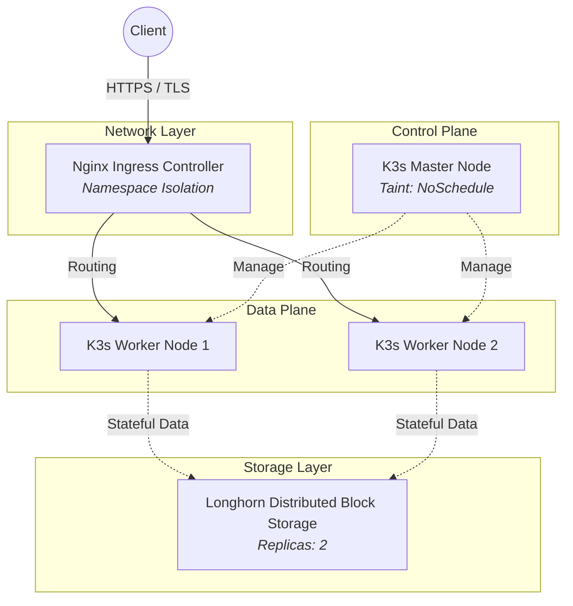

# Distributed Banking Kubernetes Infrastructure (K3s + Longhorn)

Bu depo, Spring Cloud tabanlı mikroservis bankacılık uygulamasının, bare-metal (fiziksel/sanal makine) Kubernetes (K3s) kümesi üzerinde yüksek erişilebilirlikli (High Availability), dayanıklı ve tam gözlemlenebilir bir mimariyle canlıya alınma (deployment) yapılandırmalarını içerir.

## 📐 Sistem Mimarisi ve Topoloji

Sistem, standart bulut sağlayıcılarının (AWS/GCP) yönetilen hizmetleri yerine, depolamadan yönlendirmeye kadar her şeyin lokalde kurgulandığı bir AR-GE altyapısı üzerine inşa edilmiştir.

### Kubernetes Topolojisi

Aşağıdaki diyagram, 1 Master ve 2 Worker Node'dan oluşan K3s kümesindeki ağ, depolama ve iş yükü dağılımını göstermektedir:



## 🧠 Temel Mimari Kararlar

* **Cluster Yük Dağılımı:** Master node, `NoSchedule` taint'i ile izole edilmiştir. Control-plane süreçlerinin tıkanmaması için tüm uygulama iş yükleri (workloads) sadece Worker node'lar üzerinde çalıştırılır.
* **Dağıtık Depolama (Distributed Storage):** Stateful veritabanları (PostgreSQL) ve metrik verileri (Grafana) için Kubernetes native blok depolama çözümü olan **Longhorn** kullanılmıştır. Her PVC verisi worker node'lar arasında eşzamanlı olarak replike edilir (RPO=0). Node'lardan biri çökse dahi sistem veri kaybı yaşamadan çalışmaya devam eder.
* **Gözlemlenebilirlik (Observability Stack):** Sistem metrikleri için Prometheus, Grafana, Node Exporter ve K3s containerd entegrasyonlu cAdvisor kullanılmıştır. Uygulama logları ELK Stack (Elasticsearch, Logstash, Kibana) ile merkezi hale getirilmiştir.
* **Ağ ve Güvenlik Yönetimi:** Nginx Ingress Controller üzerinden namespace tabanlı izolasyon (`default` ve `longhorn-system`) kurgulanmış, self-signed TLS sertifikaları ile güvenli haberleşme sağlanmıştır. Host-header bazlı yönlendirmeler ile DNS bypass işlemleri K8s kalkanlarıyla (hostAliases) desteklenmiştir.
* **Sıfır Kesinti (Zero-Downtime) Kalkanı:** Java (Spring Boot) tabanlı mikroservislerin başlangıçtaki yoğun CPU tüketimi sırasında Ingress Controller'ın "502 Bad Gateway" fırlatmasını önlemek için, Actuator destekli **Readiness Probes (Hazırlık Kontrolleri)** yapılandırılmıştır.

## 📂 Dizin Yapısı (GitOps Yaklaşımı)

Sistem bağımlılık sırasına göre modüler olarak klasörlenmiştir:

* `00-infrastructure/` - ConfigMap, Secret şablonları ve TLS sertifika hazırlıkları.
* `01-backing-services/` - PostgreSQL Cluster, Redis ve RabbitMQ broker'ları.
* `02-enterprise-core/` - Keycloak (Kimlik Yönetimi) ve Eureka (Keşif Sunucusu).
* `03-microservices/` - API Gateway ve Bankacılık (Core, Auth, Bill, vb.) servisleri.
* `04-frontend/` - Next.js tabanlı istemci arayüzü.
* `05-ingress/` - Nginx Ingress yönlendirme kuralları (Longhorn dahil).
* `06-observability/` - ELK Stack ve Prometheus/Grafana/cAdvisor yığınları.

## 🚀 Kurulum ve Çalıştırma

### Ön Koşullar

* K3s (veya standart K8s) 1 Master + 2 Worker topolojisinde kurulu olmalıdır.
* Cluster'da **Longhorn** depolama çözümü kurulu olmalıdır (StorageClass: `longhorn`).
* Ingress Controller (Nginx) kurulu olmalıdır.
* Lokal bilgisayarınızın `/etc/hosts` (veya `C:\Windows\System32\drivers\etc\hosts`) dosyasına aşağıdaki domainler eklenmelidir:
    `127.0.0.1 app.bank.local api.bank.local auth.bank.local eureka.bank.local monitor.bank.local docs.bank.local longhorn.bank.local`

### Adım 1: Güvenlik Yapılandırması (Secrets)

Gerçek şifreler güvenlik gereği repoda tutulmamaktadır. Kendi sırlarınızı (secrets) oluşturmalısınız:

```bash
cp 00-infrastructure/bank-secret.example.yaml 00-infrastructure/bank-secret.yaml
```
Oluşturduğunuz `bank-secret.yaml` dosyasını açın ve içindeki veritabanı, Keycloak ve Grafana şifrelerinizi belirleyin.
*(Not: `KEYCLOAK_CLIENT_SECRET` alanını şimdilik boş bırakın, Adım 3'te dolduracağız).*

### Adım 2: Deployment Sırası

Bağımlılıkların doğru ayağa kalkması için altyapıyı aşağıdaki sırayla cluster'ınıza uygulayın:

```bash
kubectl apply -f 00-infrastructure/
kubectl apply -f 01-backing-services/
kubectl apply -f 02-enterprise-core/
kubectl apply -f 03-microservices/
kubectl apply -f 04-frontend/
kubectl apply -f 05-ingress/
kubectl apply -f 06-observability/
```
*Sistem ayağa kalkarken mikroservislerin Readiness Probe'ları devreye girecek ve uygulamalar tam olarak hazır olana kadar Nginx Ingress trafiği bekletecektir (Bu işlem donanıma bağlı olarak 5-10 dk sürebilir).*

### Adım 3: Keycloak Yapılandırması (Zorunlu İlk Kurulum)

Sistem ayağa kalktıktan sonra, mikroservislerin Zero-Trust mimarisinde kimlik doğrulama yapabilmesi için Keycloak üzerinde aşağıdaki adımlar izlenmelidir:

1.  **Giriş:** Tarayıcıdan `https://auth.bank.local` adresine gidin. `bank-secret.yaml` içinde belirlediğiniz `KC_ADMIN_USER` ve şifresi ile giriş yapın.
2.  **Realm Oluşturma:** Sol üst menüden **Create Realm** diyerek `bank-realm` adında bir realm açın.
3.  **Client Oluşturma:** Sol menüden **Clients -> Create client** diyerek `bank-auth-client` adında bir istemci oluşturun. *Capability config* sayfasında **Client authentication** ve **Service accounts roles** seçeneklerini **ON** yapın.
4.  **Servis İzinlerini Atama (Kritik):** Auth mikroservisinin Keycloak ile API üzerinden haberleşebilmesi için yetki vermemiz gerekir. `bank-auth-client` detaylarındayken **Service accounts roles** sekmesine tıklayın. *Assign role* butonuna basıp filtreyi *Filter by clients* yapın. Çıkan listeden `realm-management` istemcisine ait **`view-users`**, **`manage-users`** ve **`view-realm`** rollerini seçerek atayın.
5.  **Rolleri Tanımlama:** Sol menüden **Realm roles -> Create role** diyerek büyük harflerle şu 3 rolü ekleyin: `ADMIN`, `RETAIL_CUSTOMER`, `CORPORATE_MANAGER`.
6.  **Secret Kopyalama:** `bank-auth-client` detay sayfasında **Credentials** sekmesindeki **Client Secret** değerini kopyalayın.

**Son Adım (Uygulamaları Güncelleme):**
Kopyaladığınız Secret değerini `bank-secret.yaml` dosyasındaki `KEYCLOAK_CLIENT_SECRET` alanına yapıştırın. Ardından Secret'ı ve ona bağlı podları K8s üzerinde güncelleyin:

```bash
kubectl apply -f 00-infrastructure/bank-secret.yaml
kubectl rollout restart deployment api-gateway auth-service frontend
```

### Adım 4: İlk Admin Kullanıcısını Yetkilendirme

Sistem tamamen ayağa kalkıp uygulamalar güncellendikten sonra, frontend arayüzünden (`https://app.bank.local`) kayıt ekranını kullanarak kendiniz için ilk müşteri kaydını oluşturun (Örn: TC Kimlik No `11111111111`).

Kayıt işlemi bittikten sonra bu kullanıcıyı sistem yöneticisi (ADMIN) yapmak ve hesabını onaylamak için veritabanına pod üzerinden doğrudan müdahale etmemiz gerekmektedir. Terminalinizde aşağıdaki komutu çalıştırarak kullanıcınızı yetkilendirin:

```bash
kubectl exec -it $(kubectl get pod -l app=postgres-auth -o jsonpath='{.items[0].metadata.name}') -- psql -U postgres -d bank_auth_db -c "UPDATE app_users SET role = 'ADMIN', status = 'APPROVED' WHERE identity_number = '11111111111';"
```

Bu işlemden sonra belirlediğiniz şifre ile arayüze giriş yapabilir ve tüm bankacılık platformunu yönetmeye başlayabilirsiniz.
```

Sisteminiz kullanıma ve test edilmeye tamamen hazırdır!# bank-kubernetes
